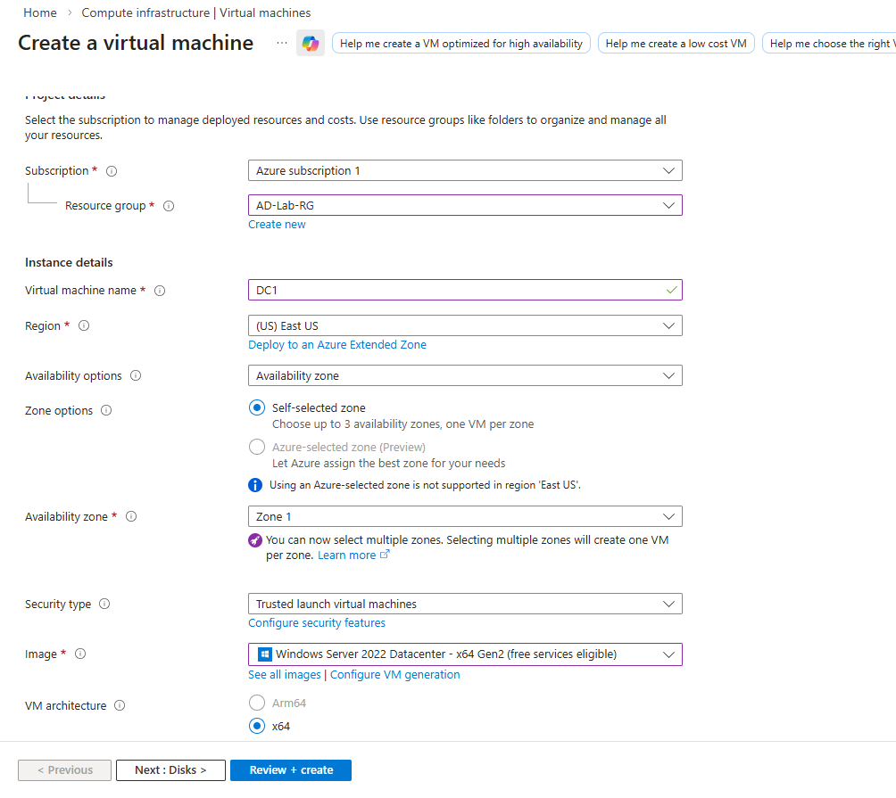
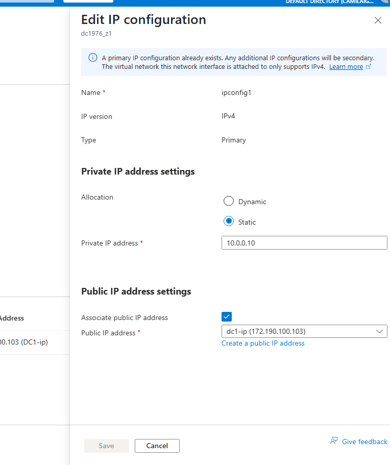
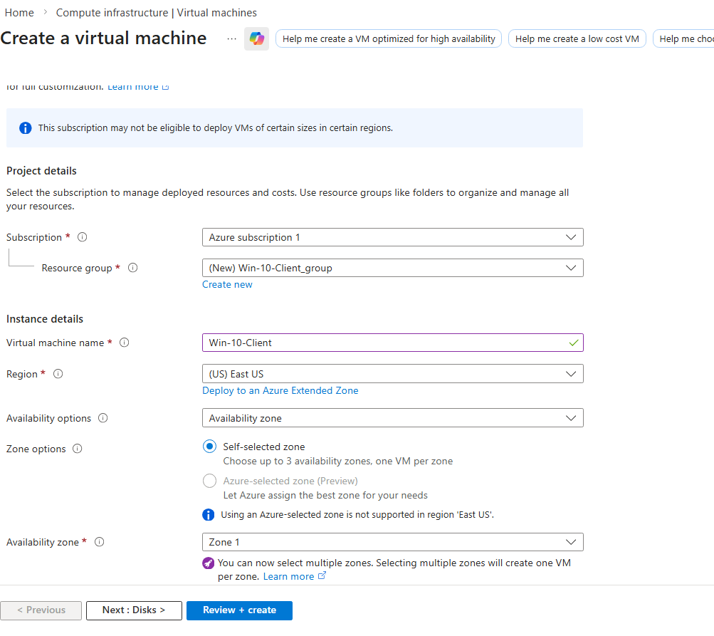

# Active Directory Domain Services Implementation with DNS and DHCP on Microsoft Azure

## Project Summary

**What This Project Is**

I deployed a Windows Server 2022 virtual machine in Microsoft Azure and configured it as a Domain Controller with Active Directory Domain Services, DNS, and DHCP. This project demonstrates how to set up a complete identity and network infrastructure in the cloud, including user management, name resolution, and automatic IP assignment. This simulates what IT professionals do when setting up a company's core IT services.

**Languages Used**
- PowerShell - Used for creating users and automating tasks

**Environments Used**
- Microsoft Azure (Cloud Platform)
- Windows Server 2022 (Domain Controller)
- Windows 10 Pro (Client Machine)
- Azure Virtual Network

**Technologies/Applications/Services Used**
- Microsoft Azure Virtual Machines
- Active Directory Domain Services (AD DS)
- DNS Server
- DHCP Server
- Azure Networking (Virtual Networks, Network Security Groups)
- Group Policy
- PowerShell

---

## Demonstration

### Phase 1: Azure Environment Setup

**Step 1: Create Azure Free Account**
I signed up for an Azure free account at portal.azure.com. The free account includes $200 credit for the first 30 days and 12 months of free services.

**Step 2: Create Resource Group**
In the Azure portal, I created a new resource group named "AD-Lab-RG" to organize all resources for this project.

**Step 3: Create Virtual Network**
I created a virtual network with:
- Name: AD-VNet
- Address space: 10.0.0.0/16
- Subnet: Default (10.0.0.0/24)

**Step 4: Create Windows Server 2022 VM**

In the Azure portal, I created a virtual machine with these settings:
- Resource group: AD-Lab-RG
- Virtual machine name: DC1
- Image: Windows Server 2022 Standard - x64 Gen2
- Size: Standard_B2ats_v2 (2 vCPUs, 1 GB RAM) - Free tier eligible
- Administrator account: azureadmin / [password]
- Inbound ports: Allow RDP (3389)


*Creating the Windows Server 2022 VM in Azure portal*

**Step 5: Review and Create**
Clicked "Review + create" and then "Create" to deploy the VM.


*VM deployment in progress and complete*

---

### Phase 2: Connect to Azure VM and Configure Network

**Step 6: Connect via RDP**

After deployment, I connected to the VM using Remote Desktop:
- Downloaded the RDP file from Azure portal
- Opened the file and clicked "Connect"
- Entered the administrator credentials


*Connecting to the Azure VM via Remote Desktop*

**Step 7: Set Static Private IP in Azure**

Since this will be a Domain Controller, it needs a static IP:
- Went to Azure Portal → VM → Networking
- Clicked on the network interface
- Clicked "IP configurations"
- Changed private IP assignment from Dynamic to Static
- Set IP to 10.0.0.10
- Wrote down this IP address


*Setting static private IP in Azure portal*

---

### Phase 3: Install Active Directory Domain Services

**Step 8: Open Server Manager**
After logging into the VM, Server Manager opened automatically.

**Step 9: Add AD DS Role**
In Server Manager:
- Clicked "Manage" → "Add Roles and Features"
- Clicked Next until "Server Roles"
- Checked "Active Directory Domain Services"
- Clicked "Add Features" when prompted
- Clicked Next through remaining screens
- Clicked "Install"


*Selecting Active Directory Domain Services role*

**Step 10: Installation Complete**
Waited for installation to finish (about 5-10 minutes).


*AD DS role installed successfully*

---

### Phase 4: Promote to Domain Controller

**Step 11: Launch Promotion Wizard**
Clicked the yellow flag icon in Server Manager and selected "Promote this server to a domain controller".


*Promoting server to Domain Controller*

**Step 12: Create New Forest**
Selected "Add a new forest" and entered domain name: "hybridlab.local"


*Creating new forest with domain hybridlab.local*

**Step 13: Set DSRM Password**
Set Directory Services Restore Mode password and saved it securely.

**Step 14: DNS Options**
Confirmed DNS server will be installed automatically.

**Step 15: NetBIOS Name**
Accepted default NetBIOS name: HYBRIDLAB.

**Step 16: Prerequisites Check**
Waited for prerequisite checks to complete. All passed.


*Prerequisite checks passed successfully*

**Step 17: Install**
Clicked "Install". Server restarted automatically after installation.

---

### Phase 5: Post-Installation Verification

**Step 18: Log Back In**
After restart, logged in as HYBRIDLAB\azureadmin (domain admin).

**Step 19: Verify Active Directory**
Opened Server Manager → Tools → Active Directory Users and Computers.


*Active Directory Users and Computers console*

**Step 20: Verify DNS**
Opened Server Manager → Tools → DNS Manager.


*DNS Manager showing forward lookup zone*

**Step 21: Test DNS Resolution**
Opened Command Prompt and ran: nslookup hybridlab.local

Result: Resolved to 10.0.0.10 ✓


*DNS resolution test successful*

---

### Phase 6: Create Organizational Units and Users

**Step 22: Create Organizational Units**
In Active Directory Users and Computers:
- Right-clicked domain → New → Organizational Unit
- Created these OUs:
  - Sales
  - HR
  - IT
  - Admin


*Creating Organizational Units for departments*

**Step 23: Create Test Users**

Created users in their respective OUs:

| Username | Full Name | Department | OU |
|----------|-----------|------------|-----|
| j.smith | John Smith | Sales | Sales |
| l.wong | Lisa Wong | Sales | Sales |
| s.johnson | Sarah Johnson | HR | HR |
| m.chen | Mike Chen | HR | HR |
| d.brown | David Brown | IT | IT |
| a.patel | Amy Patel | IT | IT |
| r.wilson | Robert Wilson | Admin | Admin |


*Test users created in their department OUs*

**Step 24: PowerShell Script for User Creation**

Used this PowerShell script to create users in bulk:
```powershell
$users = @("j.smith", "l.wong", "s.johnson", "m.chen", "d.brown", "a.patel", "r.wilson")
$password = ConvertTo-SecureString "Password123!" -AsPlainText -Force

foreach ($user in $users) {
    New-ADUser -Name $user `
        -SamAccountName $user `
        -UserPrincipalName "$user@hybridlab.local" `
        -Path "OU=Sales,DC=hybridlab,DC=local" `
        -AccountPassword $password `
        -Enabled $true
}
```

### Phase 7: Install and Configure DHCP

**Step 25: Install DHCP Role**
In Server Manager:
- Clicked "Manage" → "Add Roles and Features"
- Clicked Next until "Server Roles"
- Checked "DHCP Server"
- Clicked "Add Features" when prompted
- Clicked Next through remaining screens
- Clicked "Install"


*Adding DHCP Server role*

**Step 26: Complete DHCP Configuration**
After installation:
- Clicked "Complete DHCP configuration" in the notification flag
- Clicked "Commit" to authorize the server in Active Directory
- Clicked "Close"

**Step 27: Open DHCP Console**
Opened Server Manager → Tools → DHCP.

**Step 28: Create DHCP Scope**

In DHCP console:
- Expanded the server name
- Right-clicked "IPv4" → "New Scope"
- Clicked "Next" on welcome screen

**Scope Configuration:**
- **Name:** "Client Computers"
- **Description:** IP range for domain clients
- **IP Range:** 10.0.0.100 to 10.0.0.200
- **Subnet mask:** 255.255.255.0
- **Add Exclusions:** 10.0.0.1 to 10.0.0.49
- **Lease duration:** 8 days (default)
- **Configure DHCP Options:** Yes

**DHCP Options:**
- **Default gateway:** 10.0.0.1
- **DNS server:** 10.0.0.10
- **Activate scope:** Yes


*Creating DHCP scope for clients*

**Step 29: Activate Scope**
Activated the scope to start handing out IP addresses.


*DHCP scope activated and ready*

---

### Phase 8: Create Windows 10 Client VM

**Step 30: Create Windows 10 Client in Azure**

In Azure portal, I created another VM:
- **Name:** Win10-Client
- **Image:** Windows 10 Pro - x64 Gen2
- **Size:** Standard_B2ats_v2 (free tier eligible)
- **Resource group:** AD-Lab-RG (same as DC)
- **Virtual network:** AD-VNet (same as DC)
- **Subnet:** Default (10.0.0.0/24)
- **Admin username:** clientadmin
- **Password:** [saved securely]
- **Inbound ports:** Allow RDP (3389)


*Creating Windows 10 client VM in same VNet*

**Step 31: Connect to Client VM**
- Went to VM in Azure portal
- Clicked "Connect" → "RDP"
- Downloaded RDP file
- Opened and connected
- Entered clientadmin credentials

---

### Phase 9: Client Configuration and Domain Join

**Step 32: Configure Client DNS**

On the Windows 10 client:
- Right-clicked network icon (bottom right)
- Clicked "Open Network & Internet settings"
- Clicked "Change adapter options"
- Right-clicked Ethernet → "Properties"
- Selected "Internet Protocol Version 4 (TCP/IPv4)"
- Clicked "Properties"
- Selected "Use the following DNS server addresses"
- **Preferred DNS server:** 10.0.0.10
- Clicked "OK" and closed all windows


*Setting client DNS to Domain Controller*

**Step 33: Verify DHCP Working**

Opened Command Prompt and ran:ipconfig /all


**Results:**
- IP Address: 10.0.0.100 ✓
- Subnet Mask: 255.255.255.0 ✓
- Default Gateway: 10.0.0.1 ✓
- DHCP Server: 10.0.0.10 ✓
- DNS Server: 10.0.0.10 ✓


*Client received IP from DHCP scope*

**Step 34: Join Client to Domain**

Went to:
- Settings → System → About
- Clicked "Rename this PC (Advanced)"
- Clicked "Change"
- Under "Member of", selected "Domain"
- Entered: `hybridlab.local`
- Clicked "OK"


*Joining client to hybridlab.local domain*

**Step 35: Enter Domain Credentials**

When prompted:
- **Username:** HYBRIDLAB\azureadmin
- **Password:** [domain admin password]
- Clicked "OK"

**Step 36: Welcome Message**


*Welcome to the hybridlab.local domain*

**Step 37: Restart Computer**
- Clicked "OK" to close welcome message
- Clicked "OK" to close Computer Name/Domain Changes
- Clicked "Close"
- Clicked "Restart Now"

**Step 38: Log in as Domain User**

After restart:
- Clicked "Other user"
- **Username:** HYBRIDLAB\j.smith
- **Password:** Password123!
- Pressed Enter


*Logging in as domain user j.smith*

**Step 39: First Login Processing**
Windows set up the user profile automatically.

---

### Phase 10: Final Verification

**Step 40: Verify User Context**

Opened Command Prompt and ran: whoami

**Output:** hybridlab\j.smith ✓

**Step 41: Test Network Connectivity**
ping 10.0.0.10
ping hybridlab.local


Both received replies ✓


*Network connectivity tests successful*

**Step 42: Verify DNS Resolution**
nslookup hybridlab.local

**Output:** 10.0.0.10 ✓

**Step 43: Verify DHCP Lease**
ipconfig /all

Confirmed IP is from DHCP scope (10.0.0.100) ✓

**Step 44: Verify AD Computer Object**

On the Domain Controller (DC1):
- Opened Server Manager → Tools → Active Directory Users and Computers
- Clicked on "Computers" container
- Client computer appeared in the list


*Client computer object in Active Directory*

**Step 45: Test Access to Domain Resources**
\dc1\sysvol

Accessed successfully (shows permissions work) ✓

---

## Verification Tests Summary

| Test | Command/Task | Result |
|------|--------------|--------|
| Domain Controller Status | Check services on DC | ✅ Operational |
| DNS Resolution | nslookup hybridlab.local | ✅ Resolved to 10.0.0.10 |
| DHCP Assignment | ipconfig /all on client | ✅ IP from scope (10.0.0.100) |
| Domain Join | Computer properties | ✅ Joined to hybridlab.local |
| User Authentication | Login as j.smith | ✅ Successful |
| Network Connectivity | ping 10.0.0.10 | ✅ Successful |
| AD Computer Object | Check in ADUC | ✅ Client appears in Computers |
| Resource Access | \\dc1\sysvol | ✅ Accessible |

---

## Final Status

| Component | Status |
|-----------|--------|
| Azure VM Deployment (DC1) | ✅ Complete |
| Azure VM Deployment (Client) | ✅ Complete |
| Active Directory Domain Services | ✅ Installed and configured |
| Domain (hybridlab.local) | ✅ Created |
| DNS Server | ✅ Working |
| DHCP Server | ✅ Configured and active |
| DHCP Scope | ✅ Clients receiving IPs |
| Organizational Units | ✅ Created (Sales, HR, IT, Admin) |
| Test Users | ✅ Created (7 users) |
| Windows 10 Client | ✅ Deployed |
| Client DNS Configuration | ✅ Pointing to DC |
| Client Domain Join | ✅ Successful |
| Client Authentication | ✅ Working |
| All Tests | ✅ Passed |

---

## What I Learned

- How to deploy Windows Server VMs in Microsoft Azure
- How to configure static IPs in Azure for Domain Controllers
- How to install and configure Active Directory Domain Services
- How DNS and DHCP work together in a domain environment
- How to create Organizational Units and users with PowerShell
- How to join client computers to a domain
- How Azure networking integrates with on-premises-style services
- The importance of proper planning for IP addressing and naming
- How to verify all components work together

---

## Skills Demonstrated

| Skill | How I Demonstrated It |
|-------|----------------------|
| **Azure Administration** | Deployed and configured VMs in cloud |
| **Active Directory** | Set up domain, OUs, users, groups |
| **DNS Configuration** | Verified name resolution, tested with nslookup |
| **DHCP Setup** | Created scope, exclusions, options |
| **PowerShell** | Automated user creation |
| **Client Management** | Joined Windows 10 to domain |
| **Network Configuration** | Set DNS on client, verified DHCP |
| **Troubleshooting** | Verified each component works |
| **Documentation** | Created step-by-step guide with screenshots |

---

## Troubleshooting Notes

| Issue | Solution |
|-------|----------|
| Client couldn't find domain | Checked DNS was set to DC's IP |
| DHCP not assigning IPs | Verified scope activated and authorized |
| Domain join failed | Used domain admin credentials, not local |
| Login as domain user slow | First login takes time to create profile |
| Can't ping by name | Flushed DNS: `ipconfig /flushdns` |

---

## Next Steps

Now that the domain environment is fully functional, I can:
- Implement Group Policies for security settings
- Set up file shares with permissions
- Add more users and computers
- Move on to WSUS project using this Domain Controller
